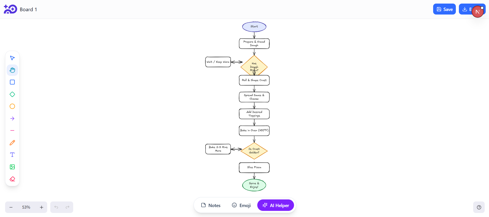
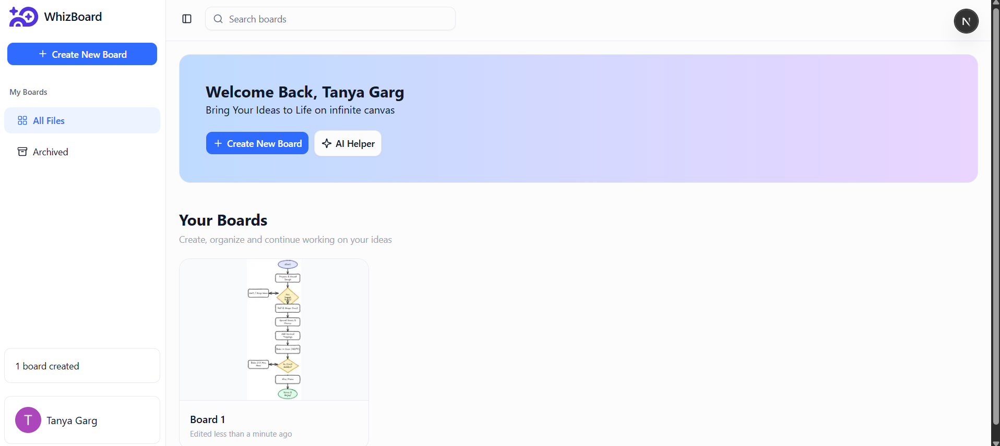
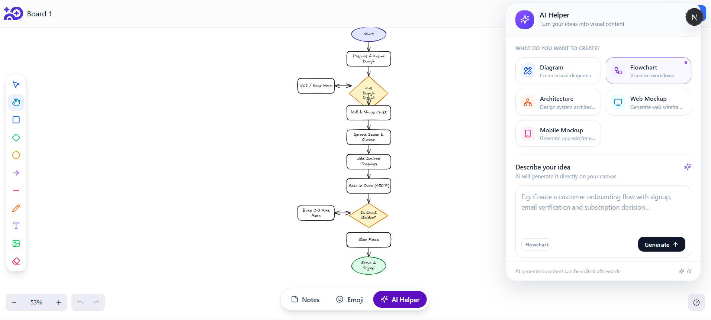
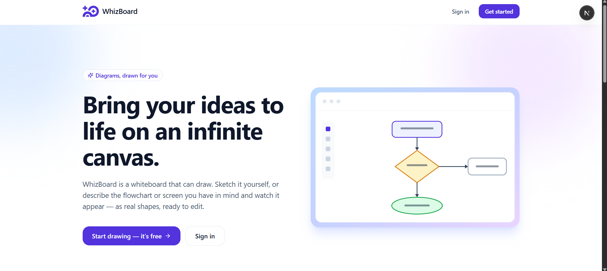

<div align="center">


# WhizBoard

**A whiteboard that can draw.**

Sketch on an infinite canvas — or describe the flowchart or screen you have in
mind and watch it appear as real, editable shapes.

<!-- Once deployed, drop the URL here: -->
<!-- [**Live demo →**](https://your-app.vercel.app) -->


</div>

---

## What it looks like

<div align="center">

### The canvas

Draw by hand, or let the AI lay a diagram out for you.



### Your boards

Every board with a live thumbnail of what's on it.



### Ask for a diagram



### Landing



</div>

---

## Features

- **Describe it, don't draw it** — ask for a login screen or an onboarding
  flow and it comes back as shapes you can move, restyle and build on, not a
  flat image.
- **A real canvas** — rectangles, diamonds, ellipses, arrows, lines, freehand,
  text and images, on an infinite pannable surface.
- **Saves while you think** — every change is written as you work, debounced,
  with a thumbnail generated for the dashboard.
- **Archive, don't delete** — boards are soft-deleted, listed on their own
  page, and restorable. Permanent deletion is a separate, deliberate action.
- **Search** — filter boards by name from anywhere in the dashboard.
- **Rename** — inline, from the board card.
- **Export** — take any board out as a PNG.

## Stack

| Piece | Used for |
| --- | --- |
| Next.js 16 (App Router) + React 19 | app framework |
| Clerk | authentication |
| Neon Postgres + Drizzle ORM | boards and canvas data |
| Excalidraw | the canvas itself |
| Google Gemini | generating diagrams from a prompt |
| Tailwind v4 + shadcn / Base UI | interface |

## Running it locally

```bash
npm install
cp .env.example .env   # then fill in the real values
npm run db:push        # create the tables on your Neon database
npm run dev
```

Open [localhost:3000](http://localhost:3000).

### Environment variables

Every key in `.env.example` is required:

| Variable | Where it comes from |
| --- | --- |
| `DATABASE_URL` | Neon → your project → connection string |
| `NEXT_PUBLIC_CLERK_PUBLISHABLE_KEY` | Clerk dashboard → API keys |
| `CLERK_SECRET_KEY` | Clerk dashboard → API keys |
| `NEXT_PUBLIC_CLERK_SIGN_IN_URL` | `/sign-in` |
| `NEXT_PUBLIC_CLERK_SIGN_UP_URL` | `/sign-up` |
| `NEXT_PUBLIC_APP_URL` | `http://localhost:3000` locally |
| `GEMINI_API_KEY` | Google AI Studio |

## Layout

```
app/
  api/
    ai/          POST -> Gemini, returns canvas elements as JSON
    projects/    boards: create, list, rename, archive, restore, delete
    users/       creates the users row for a Clerk account on first load
    whiteboard/  saves and loads canvas data
  dashboard/     board grid, plus the archive page
  workspace/     a single board
  page.tsx       landing page
components/
  custom/        this app's components, grouped by the page they belong to
  ui/            shadcn output — vendored, not linted
context/         small client-side providers (board search, user detail)
db/              Drizzle schema and client
proxy.ts         Clerk middleware (Next 16's replacement for middleware.ts)
```

## How the AI part works

`POST /api/ai` sends the user's prompt to Gemini along with a strict spec: an
allowed set of element types, absolute pixel coordinates, a grid to lay out on,
and a required JSON shape. The response is parsed leniently — models like to
wrap JSON in code fences — then converted into Excalidraw elements and dropped
onto the canvas.

Two things make it reliable in practice: transient `429`/`503` responses are
retried with exponential backoff, and if the model returns a near-empty diagram
the request is retried once with a blunter instruction. A thinner retry never
replaces a usable first answer.

## Scripts

```bash
npm run dev         # dev server
npm run build       # production build
npm run lint        # eslint
npm run db:push     # push schema changes to Neon
npm run db:studio   # browse the database
```

## Deploying

Vercel: import the repo, add every variable from `.env.example` to the
project's environment, and deploy. A few things to do once:

- Point `NEXT_PUBLIC_APP_URL` at the deployed URL.
- Move Clerk from its development instance to a production one and swap in the
  live keys, otherwise sign-in shows a "Development mode" banner.
- Rename the application in the Clerk dashboard — the sign-in card's heading
  comes from there, not from this code.
